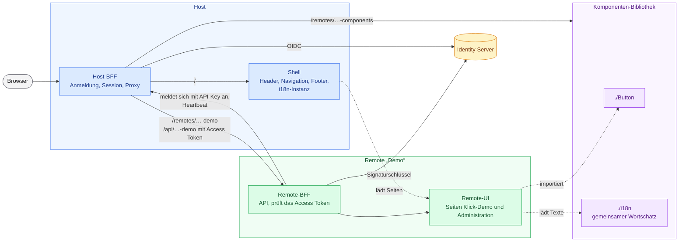
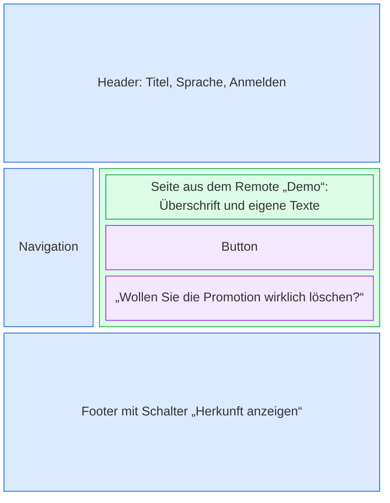
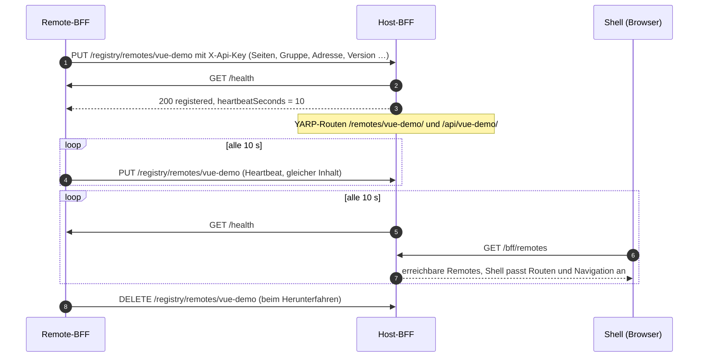
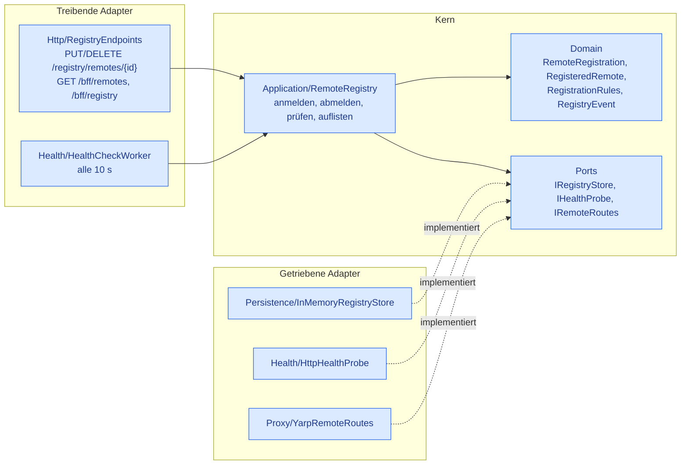

# Microfrontend-Plattform

Eine Microfrontend-Plattform mit .NET-10-BFFs und zwei voneinander unabhängigen UI-Varianten (Vue und React). Jede Variante besteht aus drei Teilen, die getrennt gebaut und betrieben werden:

- **Host** mit eigenem BFF: liefert die Shell aus und kümmert sich um Anmeldung, Navigation, die Seiten 401/403/404 und eine Debugseite.
- **Remote „Demo“** mit eigenem BFF: das BFF liefert die Oberfläche des Remotes (Klick-Demo und Administration) und dessen API. Ist der Benutzer Admin, zeigt die Demo-Seite einen Hinweis, den das Remote-BFF aus dem Access Token ableitet.
- **Komponenten-Bibliothek** als eigenes Remote: stellt einen Button und den gemeinsamen Wortschatz aller Remotes bereit, die andere Remotes per Module Federation einbinden.

Alle Teile sind zweisprachig (Deutsch, Englisch). Die Sprache wählt man in der Shell, Remotes und Bibliothek ziehen mit.

```
Browser ──► Vue Host-BFF :5010 (ASP.NET Core + YARP, Cookie-Session)
              ├─ /bff/login, /bff/logout, /bff/user   Anmeldung per OIDC (Code + PKCE) am Identity Server
              ├─ /bff/remotes                         erreichbare Remotes für die Shell
              ├─ /bff/registry                        alles über die Remotes, nur für Admins
              ├─ /registry/remotes/{id}      ◄── Remotes melden sich mit API-Key an (Heartbeat) und ab
              ├─ /swagger                             Swagger UI der Host-API
              ├─ /remotes/vue-demo/**        ──► Vue Demo-BFF :5011 ──► Remote-UI (Vite :5174)   (Route aus der Registry)
              ├─ /api/vue-demo/**            ──► Vue Demo-BFF :5011  (Access Token als Bearer, nie das Cookie)
              ├─ /remotes/vue-components/**  ──► Komponenten-Bibliothek (Vite :5175)
              └─ alles andere                ──► Shell (Vite :5173)

Browser ──► React Host-BFF :5020 (gleicher Aufbau)
              ├─ /remotes/react-demo/**, /api/react-demo/**  ──► React Demo-BFF :5021 ──► Remote-UI (Vite :5184)
              ├─ /remotes/react-components/**                ──► Komponenten-Bibliothek (Vite :5185)
              └─ alles andere                                ──► Shell (Vite :5183)

Identity Server :5001 (eigenes Repo Marcel-B/Identity, OpenIddict + ASP.NET Core Identity, Rollen)
```

## Überblick

Die Farben stehen für die Teile einer Variante, in Vue und React gleich: **blau** der Host (Host-BFF und Shell), **grün** das Remote (Remote-BFF und Remote-UI), **lila** die Komponenten-Bibliothek (Komponenten und gemeinsamer Wortschatz), **gelb** der Identity Server. Durchgezogene Pfeile sind HTTP-Aufrufe, gestrichelte das Laden im Browser per Module Federation.



Eine Seite der Anwendung setzt sich so zusammen:



In der laufenden Anwendung zeigt der Schalter „Herkunft anzeigen“ im Footer dieselben Farben: Jeder Bereich bekommt einen gestrichelten Rahmen in der Farbe des Teils, aus dem er kommt. Die Bereiche markieren sich dafür selbst mit `data-origin="host"`, `"remote"` oder `"library"`, die Rahmen zeichnet das CSS der Shell (`src/lib/origin.ts`). Neue Remotes setzen `data-origin="remote"` an das Wurzelelement ihrer Seiten.

## Aufbau

```
shared/
  Mfe.HostBff/          Bausteine eines Host-BFF (OIDC + Cookie, CSRF, Token-Refresh, YARP, Remote-Registry, Swagger UI, Shell)
  Mfe.RemoteBff/        Bausteine eines Remote-BFF (JWT Bearer, UI-Hosting, Anmeldung am Host, Health)
  Mfe.ClientApp/        Oberfläche im BFF-Projekt: Vite-Start mit dotnet run, npm bei Build und Publish
  Mfe.Bff.Tests/        Tests der Bausteine und der Konfiguration beider Varianten
vue/
  host/                 Vue Host-BFF          Mfe.Vue.HostBff      :5010
    ClientApp/          Vue-Shell             @mfe/vue-host        :5173
  remote-demo/          Vue Demo-BFF          Mfe.Vue.DemoBff      :5011
    ClientApp/          Vue-Remote „Demo“     @mfe/vue-remote-demo :5174
  components/           Vue-Komponenten       @mfe/vue-components  :5175
react/                  derselbe Aufbau: Host-BFF :5020, Shell :5183, Demo-BFF :5021, Remote :5184, Komponenten :5185
e2e/                    Playwright, je ein Projekt pro Variante
```

Die BFFs einer Variante sind eigene Prozesse mit eigener Konfiguration, eigenem Port und eigenem OIDC-Client. Was alle BFFs gleich machen, liegt in den beiden Bibliotheken unter `shared/`. Ein Host-BFF besteht damit nur aus einer kurzen `Program.cs` und seiner `appsettings.json`, ein Remote-BFF zusätzlich aus seinen API-Endpunkten.

| Teil | Stack |
| --- | --- |
| BFFs | .NET 10, ASP.NET Core, YARP, OpenID Connect + Cookie (Host), JWT Bearer (Remote) |
| Vue | Vite 8, Vue 3, Vue Router, Pinia, PrimeVue 4 (Aura), vue-i18n, Tailwind 4, `@module-federation/vite` |
| React | Vite 8, React 19, React Router, shadcn/ui (Radix), react-i18next, Tailwind 4, `@module-federation/vite` |
| E2E | Playwright, je ein Projekt pro Variante |

## Schnellstart

Voraussetzungen: .NET 10 SDK, Node 22+, das Repo [Marcel-B/Identity](https://github.com/Marcel-B/Identity) als Nachbarordner:

```
workspace/
├── Identity/        git clone https://github.com/Marcel-B/Identity
└── Microfrontend/   dieses Repo
```

```bash
npm install
npm run dev          # Identity und beide Varianten (4 BFFs, die ihre 6 Vite-Server selbst starten)
# oder nur eine Variante:
npm run dev:vue
npm run dev:react
```

Dann im Browser immer über das Host-BFF öffnen, nicht über die Vite-Ports:

- Vue: http://localhost:5010/
- React: http://localhost:5020/

Nur dort gibt es `/bff/*`, also die Anmeldung. Wer die Shell trotzdem über ihren Vite-Port öffnet (5173, 5183), wird zum Host-BFF umgeleitet.

Einzeln geht es wie in YuE-UI mit `dotnet run`, das BFF startet seine Oberfläche mit (siehe [Oberfläche im BFF-Projekt](#oberfläche-im-bff-projekt-clientapp)):

```bash
dotnet run --project ../Identity/src/Identity.Server --launch-profile http
dotnet run --project vue/host          # Host-BFF :5010 mit Shell und Komponenten-Bibliothek
dotnet run --project vue/remote-demo   # Demo-BFF :5011 mit Remote-UI
```

Testbenutzer (nur in Development angelegt, siehe `appsettings.Development.json` im Identity-Repo):

| Benutzer | Passwort | Rollen |
| --- | --- | --- |
| `admin` | `Admin123!` | admin, user |
| `user` | `User123!` | user |

Läuft auf Port 5001 noch eine alte Identity-Instanz, nutzt `npm run dev` sie mit. Hat sie die neuen Clients `mfe-vue-host` und `mfe-react-host` noch nicht, schlägt die Anmeldung fehl: dann die alte Instanz beenden.

## Wie die Teile zusammenspielen

**Anmeldung.** Die Shell ruft `/bff/login?returnUrl=…` am eigenen Host-BFF auf. Das Host-BFF leitet per OIDC (Authorization Code + PKCE) zum Identity Server weiter und legt nach der Rückkehr eine HttpOnly-Cookie-Session an. Tokens bleiben im Host-BFF, der Browser sieht sie nie. Das Access Token wird kurz vor Ablauf mit dem Refresh Token erneuert (`shared/Mfe.HostBff/Auth/TokenRefresher.cs`). Jedes Host-BFF hat einen eigenen OIDC-Client (`mfe-vue-host`, `mfe-react-host`) und einen eigenen Cookie-Namen, weil Browser Cookies nicht nach Port trennen.

**Benutzer und Rollen.** `GET /bff/user` liefert Name, Rollen und Claims der Session. Die Rollen kommen als `role`-Claims vom Identity Server. Abmelden geht über die `logoutUrl` aus dieser Antwort; sie enthält eine Session-ID, damit fremde Seiten niemanden abmelden können.

**Remote-BFF und Access Token.** Das Host-BFF fordert beim Login zusätzlich den API-Scope des Remotes an (`vue-demo-api` bzw. `react-demo-api`). Der Identity Server schreibt ihn als Audience in das Access Token. Ruft die Remote-UI `/api/vue-demo/me` auf, leitet das Host-BFF den Aufruf an das Demo-BFF weiter, entfernt dabei das Session-Cookie und hängt das Access Token als Bearer an. Das Demo-BFF prüft Signatur, Aussteller und Audience (`shared/Mfe.RemoteBff`) und liest die Rollen aus dem Token. So entsteht der Admin-Hinweis auf der Demo-Seite. Die Seite „Administration“ ruft zusätzlich `/api/vue-demo/admin/status` auf, das nur mit der Rolle `admin` antwortet: Die Shell blendet die Seite für andere Benutzer aus, die API prüft trotzdem selbst.

**UI-Hosting.** Jedes BFF liefert seine Oberfläche selbst aus. In Development leitet es an den Vite-Dev-Server weiter (`Shell:DevServer` bzw. `Ui:DevServer` in `appsettings.Development.json`). Den Vite-Server startet es dabei selbst. Ohne diese Einstellung liefert es die gebauten Dateien aus `wwwroot` (`Shell:Root` bzw. `Ui:Root`), die Shell mit `index.html` als Fallback für Client-Routen. Die Komponenten-Bibliothek hat kein BFF; das Host-BFF leitet `/remotes/<variante>-components/` an den Ort weiter, an dem sie liegt.

**CSRF-Schutz.** `/bff/user` und `/api/**` verlangen den Header `X-CSRF: 1`. Shell und Remotes setzen ihn bei jedem Aufruf. Fremde Seiten können den Header nicht ohne CORS-Freigabe senden.

**Remotes.** Remotes melden sich selbst am Host-BFF an (siehe [Remote-Registry](#remote-registry)). Die Shell lädt die erreichbaren Remotes von `/bff/remotes`, registriert sie bei der Module-Federation-Runtime und baut daraus Routen und Navigation; sie fragt die Liste regelmäßig neu ab, sodass Remotes ohne Neuladen erscheinen und verschwinden. Seiten mit `Roles` sind nur für angemeldete Benutzer mit einer dieser Rollen erreichbar, sonst kommt 401 bzw. 403.

**Komponenten-Bibliothek.** `vue/components` bzw. `react/components` ist ein Remote ohne Seiten, das nur Komponenten (`./Button`) und den gemeinsamen Wortschatz (`./i18n`, siehe unten) exposed. Das Demo-Remote trägt sie in seiner `vite.config.ts` unter `remotes` ein und importiert den Button wie ein Paket: `import Button from 'vueComponents/Button'`. Der Eintrag `/remotes/vue-components/remoteEntry.js` ist relativ und wird gegen die Adresse der Seite aufgelöst, also gegen das Host-BFF. Die Props stehen für TypeScript in `vue-components.d.ts` bzw. `react-components.d.ts` im Remote.

**Mehrsprachigkeit.** Die Shell besitzt die i18n-Instanz (vue-i18n bzw. i18next) und teilt sie als Singleton per Module Federation. Jedes Remote und die Bibliothek bringen ihre Texte selbst mit: In Vue per `useI18n({ useScope: 'local', messages })`, in React als eigener i18next-Namespace (`reactDemo`, `reactComponents`). Die Sprache kommt immer von der Shell: Umschalten im Header ändert Shell, Remote und Bibliothek zugleich. Die Wahl landet im `localStorage` und in `<html lang>`. Beim ersten Besuch entscheidet die Browsersprache. Seitentitel für Navigation und Tab kommen pro Sprache aus der Anmeldung des Remotes (`"Title": { "de": "Klick-Demo", "en": "Click demo" }`).

**Gemeinsamer Wortschatz.** Begriffe und Sätze, die in mehreren Remotes vorkommen („Promotion“, „Wollen Sie die Promotion wirklich löschen?“), liegen nicht in jedem Remote, sondern einmal in der Komponenten-Bibliothek: `src/common-i18n.ts`, exposed als `./i18n`. Die Bibliothek wird ohnehin von allen Remotes geladen, braucht also keinen eigenen Endpunkt. Ein Remote lädt das Modul beim ersten Gebrauch und trägt die Texte in die geteilte Instanz der Shell ein: in Vue unter `common` in die globalen Messages (`registerCommonMessages`), in React als i18next-Namespace `common` (`registerCommonTexts`). Ist der Namespace schon da, weil ein anderes Remote ihn geladen hat, passiert nichts. Eine Textänderung braucht damit ein Deployment der Bibliothek, Host und Remotes bleiben unberührt.

- Allgemeine Sätze sind parametrisiert: `confirm.delete` = „Wollen Sie {entity} wirklich löschen?“ deckt alle Entitäten ab. Weil im Deutschen der Artikel vom Fall abhängt, bringt jede Entität ihre Akkusativform mit (`entities.promotion.accusative` = „die Promotion“).
- Das Remote lädt `vueComponents/i18n` bzw. `reactComponents/i18n` per dynamischem `import()` und hat für die Texte, die es nutzt, eigene Ersatztexte (`src/common.ts`). Fehlt die Bibliothek, zeigt es diese statt leerer Keys: in Vue als `default` von `t`, in React als `defaultValue`. Die Karte „Gemeinsamer Wortschatz“ auf der Demo-Seite zeigt, woher die Texte gerade kommen.
- Die Bibliothek ist der Ort für domänenneutrale Texte und für Fachbegriffe, die mehrere Remotes einer Domäne teilen. Was nur ein Remote braucht, bleibt in dessen eigenen Texten.

**Geteilte Bibliotheken.** Vue-Teile teilen sich `vue`, `vue-router`, `pinia`, `vue-i18n` und `primevue/*`, React-Teile `react`, `react-dom`, `react-router`, `i18next` und `react-i18next` (jeweils als Singleton).

**Tailwind in Remotes.** Shell, Remotes und Bibliothek bauen ihr CSS getrennt. Damit sich gleiche Utilities nicht gegenseitig überschreiben (z. B. ein `inline-flex` aus dem Remote gegen ein `md:hidden` der Shell), nutzt jedes Remote einen eigenen Tailwind-Prefix: `demo:` im Demo-Remote, `ui:` in der Komponenten-Bibliothek. Preflight und Theme-Werte kommen von der Shell. In React kennt `components.json` den Prefix, sodass `npx shadcn add …` die Klassen gleich mit Prefix erzeugt.

## Remote-Registry

Remotes stehen nicht in der Konfiguration des Host-BFF, sie melden sich selbst an. Ein Remote-BFF schickt beim Start seine Beschreibung mit seinem API-Key an `PUT /registry/remotes/{id}` seines Host-BFF: Seiten mit Route, Titel pro Sprache, Icon und Rollen, die Gruppe in der Navigation und die Adresse, unter der der Host es erreicht. Ab dann leitet der Host `/remotes/{id}/` und `/api/{id}/` dorthin weiter und die Shell zeigt die Seiten. Beim Herunterfahren meldet es sich mit `DELETE` wieder ab.



### Was ein Remote übermittelt

| Feld | Bedeutung |
| --- | --- |
| `id` (im Pfad) | Pfadsegment für `/remotes/{id}/` und `/api/{id}/`, z. B. `vue-demo`. Muss zu `Ui:BasePath` und der Vite-`base` des Remotes passen. |
| `federationName` | Module-Federation-Name aus der `vite.config.ts`, z. B. `vueDemo`. |
| `address` | Wo der Host das Remote-BFF erreicht, z. B. `http://localhost:5011`. |
| `group` | Pflicht: Gruppe in der Navigation, z. B. `Demo`. Einfach ein Name (höchstens 40 Zeichen), er steht in beiden Sprachen gleich über den Einträgen. |
| `pages[]` | Je Seite: `path` (Route in der Shell), `title` pro Sprache (Navigation und Tab, Deutsch und Englisch Pflicht), `module` (exposed Modul), `icon` (PrimeIcons-Klasse in Vue, lucide-Name in React), `roles` (wer die Seite sehen darf), `requiresAuth`, `showInNav`, `order` (Sortierindex in der Gruppe). |
| `version` | Wird auf der Registry-Seite angezeigt; ohne Angabe die Version des Remote-BFF. |
| `displayName` | Name des Remotes pro Sprache für die Registry-Seite. |
| `apiScope` | Audience, die die API des Remotes erwartet; ohne Angabe `Jwt:Audience`. Die Registry-Seite warnt, wenn das Host-BFF diesen Scope beim Login nicht anfordert, denn dann lehnt die API die Tokens der Benutzer ab. |
| `healthPath` | Pfad, den der Host für den Health-Check aufruft, Standard `/health`. |

Im Remote-BFF steht das unter `Registration` in der `appsettings.json` (`Remote` mit den Feldern oben, dazu `HostUrl`, `Address` und `ApiKey`), den Rest erledigt `shared/Mfe.RemoteBff/Registration`. Die Antwort des Hosts nennt das Heartbeat-Intervall, der Host gibt den Takt vor.

### Navigation in Gruppen

Die Navigation hat eine Ebene mehr als die Liste der Seiten: Ganz oben steht die Startseite, als einziger Eintrag ohne Gruppe. Darunter folgen die Gruppen mit ihrem Namen als Überschrift. Remotes mit derselben `group` landen in derselben Gruppe, ihre Seiten sortiert nach `order`, egal von welchem Remote sie kommen. Eine Gruppe steht dort, wo ihr niedrigster `order` sie hinstellt, bei Gleichstand entscheidet der Name. Seiten, die ein Benutzer nicht sehen darf, fallen vorher heraus; bleibt von einer Gruppe nichts übrig, erscheint auch ihre Überschrift nicht. Die eigenen Seiten der Shell (Debug, Registry) stehen am Ende unter „System“. Die Startseite zeigt die Gruppe auf jeder Karte.

Beispiel: Das Demo-Remote meldet `Klick-Demo` (`order` 10) und `Administration` (20) in der Gruppe `Demo` an. Meldet sich ein zweites Remote mit einer Seite (`order` 15) ebenfalls unter `Demo` an, steht sie zwischen den beiden.

### Host-Neustart: Heartbeat statt Gedächtnis

Weder Host noch Remotes haben eine Datenhaltung. Der Host hält Anmeldungen deshalb nur im Speicher, als **Lease von 30 s**, und jedes Remote wiederholt seine vollständige Anmeldung **alle 10 s** als Heartbeat. Kommt kein Heartbeat mehr, verwirft der Host die Anmeldung („abgelaufen“).

| | Heartbeat mit Lease (umgesetzt) | Host merkt sich die Anmeldungen (z. B. in einer Datei) |
| --- | --- | --- |
| Nach Host-Neustart | Liste nach spätestens einem Heartbeat-Intervall wieder vollständig | Liste sofort da |
| Abgestürzte Remotes (ohne Abmeldung) | verschwinden von selbst nach Ablauf der Lease | bleiben stehen, bis ein Health-Check sie aussortiert; ein Remote, das es nicht mehr gibt, bleibt für immer in der Datei |
| Datenhaltung | keine | eine Datei pro Host-Instanz, also doch Zustand, der veralten und kaputtgehen kann |
| Last | ein kleiner `PUT` pro Remote alle 10 s | nur bei Änderungen |
| Mehrere Host-Instanzen | jede kennt nur die Remotes, deren Heartbeat bei ihr ankam: Remotes müssten jede Instanz anrufen, oder der Speicher-Port (`IRegistryStore`) bekommt einen geteilten Speicher wie Redis | dasselbe Problem, plus gleichzeitiges Schreiben in die Datei |
| Konsistenz | die Quelle der Wahrheit ist immer das laufende Remote | Datei und Wirklichkeit können auseinanderlaufen |

Der Heartbeat ist selbstheilend und kommt ohne Zustand aus; das kurze Fenster nach einem Host-Start, in dem Remotes noch fehlen, ist der Preis. Wer es kürzer will, senkt `Registry:HeartbeatInterval`.

### Erreichbarkeit

Der Host prüft alle 10 s die Health-URL jedes Remotes (`Registry:HealthCheckInterval`, Timeout 3 s). Ein neues Remote erscheint erst, wenn sein erster Check gelingt; ein erreichbares fliegt nach **zwei** Fehlschlägen in Folge aus der Navigation (`Registry:FailureThreshold`) und kommt beim nächsten erfolgreichen Check zurück. Die Routen bleiben so lange bestehen, wie die Lease läuft. Die Shell fragt `/bff/remotes` alle 10 s und beim Zurückkehren in den Tab neu ab und passt Routen und Navigation ohne Neuladen an. Ein abgestürztes Remote verschwindet damit nach etwa 20 s aus der Navigation, ein abgemeldetes sofort mit der nächsten Abfrage der Shell.

Das Remote-BFF bietet `/health` (läuft) und `/health/ready` (läuft und ist beim Host angemeldet). Playwright wartet auf `/health/ready`.

### Absicherung

- Die Anmelde-API verlangt einen API-Key im Header `X-Api-Key`. Das Host-BFF kennt einen Key pro Remote-Id (`Registry:ApiKeys`, z. B. `"vue-demo": "…"`); ein unbekannter Key ergibt 401. Der Identity Server ist nicht beteiligt: Im Betrieb liegt er nicht in unserer Hand, Dienst-Clients lassen sich dort nicht anlegen. Die Anmeldung der Benutzer bleibt davon unberührt.
- Ein Key gilt nur für seine Id: Mit dem Key von `vue-demo` lässt sich kein anderes Remote anmelden, ändern oder abmelden (403). Ein neues Remote braucht deshalb einen Eintrag unter `Registry:ApiKeys`, sonst nichts am Host.
- Die Keys gehören wie Client Secrets in User Secrets oder Umgebungsvariablen (`Registry__ApiKeys__vue-demo`, im Remote `Registration__ApiKey`). Nur `appsettings.Development.json` enthält Keys zum Ausprobieren, dazu je einen für die Remote-Id `<variante>-e2e`, mit der die Playwright-Tests ein zweites Remote anmelden. Der Host vergleicht Keys in konstanter Zeit; die Registry-Seite zeigt nur, für welche Ids es Keys gibt, nie die Keys selbst.
- Seiten dürfen keine Pfade der Shell belegen (`/`, `/debug`, `/login`, `/401`, `/403`, `/bff`, `/api`, `/remotes`, `/swagger`, … siehe `Registry:ReservedPaths`) und keine eines anderen Remotes (409). Ids, die schon eine statische Route unter `ReverseProxy` haben (die Komponenten-Bibliothek), sind ebenfalls vergeben.
- Der Host leitet an die Adresse weiter, die das Remote angibt. Wer einen Key hat, kann also Verkehr für dessen Id umlenken; Keys bekommen deshalb nur vertrauenswürdige Dienste.

### Registry-Seite und Swagger UI

Admins (Rolle `admin`, `Registry:AdminRole`) sehen in der Navigation „Registry“ (`/debug/registry`): für welche Remote-Ids es API-Keys gibt, angemeldete Remotes mit Status, Gruppe, Version, Adresse, letztem Heartbeat, Lease, Health-URL, letztem Fehler und ihren Seiten mit Titeln, Icons, Rollen und Reihenfolge; darunter abgemeldete und abgelaufene Remotes mit Zeitpunkt und den Verlauf aller Ereignisse (angemeldet, geändert, abgemeldet, abgelaufen, erreichbar, nicht erreichbar, abgelehnt). Die Seite liest `GET /bff/registry`, das ebenfalls nur Admins beantwortet, und aktualisiert sich alle 5 s. Verlauf und Liste sind wie die Anmeldungen nur im Speicher und nach einem Host-Neustart leer.

Die Swagger UI des Host-BFF liegt unter `/swagger` (Vue: http://localhost:5010/swagger, React: http://localhost:5020/swagger), das OpenAPI-Dokument unter `/openapi/v1.json`; `OpenApi:Enabled: false` schaltet beides ab. Zum Ausprobieren der Anmelde-API unter „Authorize“ einen Key aus `Registry:ApiKeys` eintragen, in Development etwa den für die Id `vue-e2e` aus `vue/host/appsettings.Development.json`. Ohne Swagger:

```bash
KEY=…   # Registry:ApiKeys:vue-e2e
curl -X PUT http://localhost:5010/registry/remotes/vue-e2e -H "X-Api-Key: $KEY" \
  -H 'Content-Type: application/json' -d '{"federationName":"vueE2e","address":"http://localhost:5011","group":"Test",
  "pages":[{"path":"/probe","title":{"de":"Probe","en":"Probe"},"module":"./DemoPage","order":30}]}'
```

### Aufbau im Host-BFF (Ports and Adapters)

Die Registry ist hexagonal aufgebaut (`shared/Mfe.HostBff/Registry`). Der Kern kennt weder HTTP noch YARP; was er von außen braucht, beschreibt er als Port, und Adapter erfüllen ihn. So lässt sich der Speicher gegen einen geteilten tauschen oder der Health-Check gegen einen anderen, ohne die Regeln anzufassen, und die Tests ersetzen alle Adapter durch Fakes (`RemoteRegistryTests`).



Nur `RegistryExtensions` kennt alle Teile und verdrahtet sie. Die HTTP-Verträge (`RegistryContracts.cs`) bilden auf die Domäne ab, damit sich beide unabhängig ändern können. Für den Rest des Host-BFF (Login, Proxy, Shell) lohnt der Aufbau nicht: dort gibt es keine fachlichen Regeln, nur Framework-Konfiguration.

### Einstellungen (`Registry` im Host-BFF)

| Schlüssel | Standard | |
| --- | --- | --- |
| `ApiKeys` | – | API-Key pro Remote-Id, z. B. `"vue-demo": "…"`; nur aus User Secrets oder Umgebungsvariablen |
| `LeaseDuration` | `00:00:30` | ohne Heartbeat so lange gültig |
| `HeartbeatInterval` | `00:00:10` | wird den Remotes in jeder Antwort mitgeteilt |
| `HealthCheckInterval`, `HealthCheckTimeout` | `00:00:10`, `00:00:03` | |
| `FailureThreshold` | `2` | Fehlschläge in Folge bis „nicht erreichbar“ |
| `HistorySize` | `200` | Einträge im Verlauf und in der Liste ehemaliger Remotes |
| `AdminRole` | `admin` | wer die Registry-Seite sieht |
| `RequiredLanguages` | `de`, `en` | Pflichtsprachen der Seitentitel |
| `ReservedPaths`, `ReservedIds` | siehe oben | zusätzliche Einträge werden angehängt |

### Grenzen

- **API-Scopes sind statisch.** Das Access Token der Benutzer bekommt seine Audiences beim Login (`Oidc:Scopes` des Host-BFF, freigegeben beim Client im Identity-Repo). Ein neues Remote mit eigener API braucht dort also weiterhin einen Eintrag; die Registry-Seite zeigt fehlende Scopes an. Dynamisch ginge das nur per Token Exchange pro Remote.
- **Eine Host-Instanz.** Siehe Tabelle oben: für mehrere Instanzen einen geteilten `IRegistryStore` einsetzen.
- **Remotes ohne BFF** (wie die Komponenten-Bibliothek) melden sich nicht an und bleiben als statische Route unter `ReverseProxy`.

## Oberfläche im BFF-Projekt (ClientApp)

Wie in YuE-UI liegt jede Oberfläche, die zu einem BFF gehört, im .NET-Projekt dieses BFF unter `ClientApp/`, und der .NET-Build kümmert sich um sie:

- `dotnet run` startet mit dem BFF dessen Vite-Server: das Host-BFF die Shell und die Komponenten-Bibliothek, das Demo-BFF die Remote-UI. Das BFF nimmt Anfragen erst an, wenn seine Vite-Server antworten, und beendet sie mit sich selbst. Läuft ein Vite-Server schon (etwa von Hand gestartet), nutzt das BFF ihn.
- `dotnet build` installiert beim ersten Mal die npm-Pakete (`npm ci` im Repo-Root).
- `dotnet publish` baut die Oberfläche und legt sie als `wwwroot` ins Publish-Verzeichnis.
- `-p:SkipClientAppBuild=true` lässt alle npm-Schritte weg, etwa wenn die Oberfläche getrennt gebaut wird.

Welche Vite-Server ein BFF startet, steht unter `DevServers` in seiner `appsettings.Development.json` (`Name`, `Url`, `Directory`, optional `Command`). Den Start übernimmt `shared/Mfe.ClientApp/DevServerLauncher.cs`, Build und Publish `shared/Mfe.ClientApp/ClientApp.targets`, das jedes BFF-Projekt importiert. Was Vite selbst ausgibt, steht nur auf Debug im Log (`"Logging:LogLevel:Mfe.ClientApp": "Debug"`), damit die Vite-Adresse nicht wie eine zweite Adresse zum Öffnen aussieht. Fehler von Vite bleiben sichtbar.

Wo Module Federation vom Muster aus YuE-UI abweicht:

- **Kein SpaProxy.** YuE-UI nutzt dafür Microsoft.AspNetCore.SpaProxy. Das startet Vite erst, wenn der Browser die Startseite des BFF aufruft, und leitet den Browser dann auf den Vite-Port um. Hier muss der Browser auf dem Host-BFF bleiben, weil Session-Cookie, `/bff`, `/api` und `/remotes` nur dort zusammenkommen. Ein Remote-BFF bekommt außerdem nie einen Aufruf direkt vom Browser, nur über den Proxy des Host-BFF, SpaProxy würde seinen Vite-Server also nie starten. Deshalb startet das BFF Vite selbst und leitet per YARP weiter. Dabei lässt es den `Cookie`-Header weg: Der Browser schickt an `localhost` alle Cookies, egal welcher Port, nach dem Anmelden in beiden Varianten über 20 KB, und Vite (Node) lehnt Header über 16 KB mit 431 ab.
- **Ein `dotnet run` pro BFF, nicht eins für alles.** Remotes werden erst zur Laufzeit geladen und getrennt ausgeliefert. Ihre Oberfläche gehört deshalb in ihr eigenes BFF und nicht ins Host-BFF. Eine Variante braucht damit mindestens zwei Prozesse (Host-BFF und Demo-BFF) plus Identity, `npm run dev` startet alle zusammen. Sollte das auch aus .NET heraus mit einem Befehl gehen, wäre ein .NET-Aspire-AppHost der nächste Schritt.
- **Die Komponenten-Bibliothek hat kein BFF.** Sie ist ein rein statisches Remote, das alle Remotes nutzen. In Development startet das Host-BFF ihren Vite-Server mit, weil es `/remotes/<variante>-components/` weiterleitet. Im Betrieb wird sie getrennt ausgeliefert und nicht mit einem BFF gebaut, sonst hinge jede Textänderung im gemeinsamen Wortschatz an dessen Release.
- **Ein Lockfile für alle Oberflächen.** In YuE-UI hat `ClientApp` eine eigene `package-lock.json`. Hier sind die ClientApps npm-Workspaces des Repos, damit die Pakete, die Module Federation als Singleton teilt (`vue`, `react`, `vue-i18n`, …), in Host und Remotes dieselbe Version haben. `npm ci` läuft deshalb im Repo-Root.
- **Die Vite-Ports bleiben.** Jeder Vite-Server braucht weiter seinen festen Port (`strictPort`), weil das BFF dorthin weiterleitet. Geöffnet wird trotzdem nur das Host-BFF; wer eine Shell über ihren Vite-Port aufruft, landet per Umleitung dort.

## Neues Remote anlegen

1. `vue/remote-demo` bzw. `react/remote-demo` kopieren. In `ClientApp/`: `name` in `package.json`, `base`, `server.port` und den Federation-`name` in `vite.config.ts` anpassen, einen eigenen Tailwind-Prefix wählen (`remote.css`, bei React zusätzlich `components.json` und `src/lib/utils.ts`). Im Projekt selbst: Projektname, Port in `launchSettings.json`, `Ui:BasePath`, `Ui:DevServer`, den Eintrag unter `DevServers` und `Jwt:Audience` anpassen.
2. Seiten über `exposes` freigeben (`'./MeineSeite': './src/pages/MeineSeite.vue'`), jeweils mit Default-Export und eigenen Texten in Deutsch und Englisch. Texte, die es schon im gemeinsamen Wortschatz gibt, über `src/common.ts` von dort nehmen (die Datei mitkopieren und die Ersatztexte auf die genutzten Keys beschränken).
3. Unter `Registration` in der `appsettings.json` des Remotes `Address` und unter `Remote` `Id` (gleich dem Pfadsegment von `Ui:BasePath`), `FederationName`, `Group` und die `Pages` (`Path`, `Title` pro Sprache, `Module`, `Icon`, optional `Roles`, `RequiresAuth`, `ShowInNav`, `Order`) eintragen; den `ApiKey` in `appsettings.Development.json` bzw. User Secrets.
4. Im Host-BFF denselben Key unter `Registry:ApiKeys:<id>` eintragen (in Development in `appsettings.Development.json`, sonst User Secrets oder Umgebungsvariable). Hat das Remote eine API: ihren Scope beim Client des Host-BFF im Identity Server freigeben und im Host-BFF unter `Oidc:Scopes` anfordern. Sonst muss am Host-BFF nichts geändert werden, Routen und Navigation entstehen aus der Anmeldung.
5. Das Projekt in `Microfrontend.slnx`, seine `ClientApp` in `workspaces` der `package.json` und das BFF in `e2e/playwright.config.ts` eintragen.

Ein Remote lässt sich auch allein entwickeln: `npm run dev -w @mfe/vue-remote-demo` (und für den Button `npm run dev -w @mfe/vue-components`), dann http://localhost:5174/remotes/vue-demo/ öffnen, mit `?lang=en` auf Englisch. Ohne Host-BFF gibt es keine Anmeldung, die Seite zeigt dann „Nicht angemeldet“. Die Komponenten-Bibliothek hat unter http://localhost:5175/remotes/vue-components/ eine eigene Vorschau.

## Tests

```bash
npm run test:bff             # .NET: Host-BFF, Registry, Remote-BFF mit Anmeldung, Konfiguration beider Varianten
npm run typecheck            # alle Frontends
npm run build                # Produktions-Builds
npm run test:e2e             # baut die BFFs, dann Playwright für beide Varianten
```

Playwright startet Identity und alle BFFs (die ihre Vite-Server mitbringen) selbst oder nutzt bereits laufende (`npm run dev`). Die Tests liegen in `e2e/tests` und laufen gegen beide Host-BFFs. Gegen eine andere Umgebung testen: `E2E_VUE_URL=https://… E2E_REACT_URL=https://… npm run test:e2e`.

## Betrieb

- `dotnet publish vue/host -c Release -o …` liefert das Host-BFF mit der gebauten Shell in `wwwroot`, `dotnet publish vue/remote-demo …` das Demo-BFF mit seiner Remote-UI. Ohne `Shell:DevServer`/`Ui:DevServer` (die nur in `appsettings.Development.json` stehen) liefern die BFFs diese Dateien aus. Die Komponenten-Bibliothek baut `npm run build -w @mfe/vue-components` nach `vue/components/dist`; sie liegt als statische Dateien irgendwo (CDN, Nginx, Blob Storage), der Cluster `<variante>-components` im Host-BFF zeigt dorthin.
- Ein Remote-BFF meldet sich unter `Registration:HostUrl` an und nennt `Registration:Address` als seine Adresse; beide zeigen in `appsettings.json` auf `localhost`. In Produktion auf die echten Adressen setzen, `Registration:ApiKey` (Remote) und `Registry:ApiKeys` (Host) wie `Oidc:ClientSecret` aus User Secrets bzw. Umgebungsvariablen.
- `Oidc:ClientSecret` gehört in User Secrets bzw. Umgebungsvariablen (`Oidc__ClientSecret`), nicht in die Datei.
- Die Session liegt im Cookie (inklusive Tokens, ASP.NET Core teilt große Cookies automatisch). Bei vielen Claims oder mehreren Instanzen eines Host-BFF lohnt ein serverseitiger `ITicketStore` und ein gemeinsamer Data-Protection-Key-Ring.
- HTTPS: In Development läuft alles über `http://localhost`. In Produktion `Oidc:RequireHttpsMetadata` und `Jwt:RequireHttpsMetadata` auf `true` lassen.
